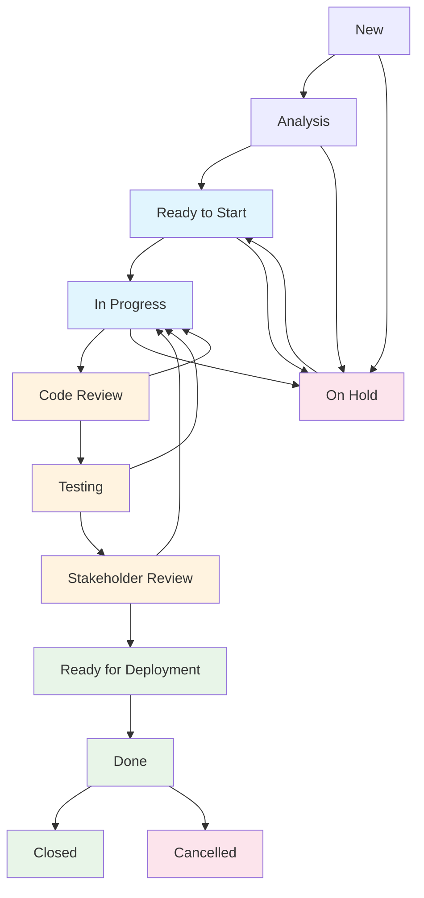

# Feature Development Lifecycle - AI-Enhanced Workflow

**📋 PURPOSE**: Feature development state management, workflow gates, communication templates
**🎯 FOR**: Day-to-day feature management, quality gates, stakeholder communication  
**📚 COMPREHENSIVE WORKFLOWS**: See [project-workflow-integration.md](project-workflow-integration.md) for detailed patterns

This guide details how to effectively manage features throughout their development lifecycle, integrating with AI-assisted development workflows and GitHub Copilot.

## How to Use This Guide with AI Assistance

### AI-Enhanced Feature Management

When working on features with AI assistance, consider:
1. **Appropriate workflow state transitions** based on development progress
2. **Required documentation and updates** for each lifecycle phase
3. **Quality gates and validation requirements** for state changes
4. **Integration with development activities** and code changes

### Effective Prompting for Feature Management

**Example of Enhanced Prompting:**

❌ **Weak**: "Update feature"
✅ **Better**: "Transition feature to Active state with detailed implementation plan, acceptance criteria validation, and integration with AL development tasks including test coverage requirements"

**Why Better**: Enhanced prompts specify the state transition (Active), include planning details (implementation plan), add validation (acceptance criteria), and connect to development activities (AL development, testing).

## Feature Development States

### State Transition Workflow



### State Descriptions and Required Actions

**New → Analysis:**
- **Trigger**: Feature request created and assigned
- **Actions Required**:
  - Define detailed requirements and acceptance criteria
  - Create user stories with measurable outcomes
  - Identify integration points and dependencies
  - Plan development approach and technology choices
  - Estimate effort and identify potential risks
  - Link to related epics/features

**Analysis → Ready to Start:**
- **Trigger**: Requirements fully defined and approved
- **Actions Required**:
  - Technical analysis complete
  - Dependencies identified and resolved
  - Implementation plan documented
  - Resource allocation confirmed
  - Development environment prepared

**Ready to Start → In Progress:**
- **Trigger**: Development begins
- **Actions Required**:
  - Update feature status with developer assignment
  - Begin implementation following documented plan
  - Create feature branch in version control
  - Set up regular progress updates
  - Activate time tracking

**In Progress → Code Review:**
- **Trigger**: Initial implementation complete
- **Actions Required**:
  - Code review requested from team members
  - Initial unit tests complete
  - Documentation updated
  - Self-review completed using AI assistance
  - Prepare for peer review

**Code Review → Testing:**
- **Trigger**: Code review approved
- **Actions Required**:
  - Deploy to test environment
  - Execute comprehensive test suite
  - Manual testing of user scenarios
  - Performance and security validation
  - Integration testing with dependent systems

**Testing → Stakeholder Review:**
- **Trigger**: All tests passing
- **Actions Required**:
  - Deploy to staging environment
  - Notify stakeholders for review
  - Provide demo and documentation
  - Collect feedback and requirements validation
  - Prepare user acceptance testing

**Stakeholder Review → Ready for Deployment:**
- **Trigger**: Stakeholder acceptance received
- **Actions Required**:
  - Document formal approval
  - Plan production deployment strategy
  - Update release schedule and documentation
  - Prepare rollback plan
  - Final deployment validation

**Ready for Deployment → Done:**
- **Trigger**: Successfully deployed to production
- **Actions Required**:
  - Validate production deployment
  - Monitor for immediate issues
  - Confirm feature functionality
  - Update documentation and user guides
  - Collect initial performance metrics

**Done → Closed:**
- **Trigger**: Post-deployment validation complete
- **Actions Required**:
  - Final stakeholder confirmation
  - Performance monitoring review
  - Support documentation finalized
  - Lessons learned documented
  - Archive implementation artifacts

## Exception States

### On Hold
- **Reasons**: Awaiting clarification, dependency blocking, resource constraints, stakeholder decision
- **Required Information**: Hold reason, expected resolution date, impact assessment
- **Actions**: Regular review schedule, stakeholder communication, dependency tracking

### Cancelled
- **Reasons**: No longer required, duplicate effort, out of scope, business priority change
- **Required Information**: Cancellation reason, impact assessment, stakeholder approval
- **Actions**: Archive related artifacts, update dependent features, notify stakeholders

## Project Management Tool Integration

### GitHub Issues Integration

**Creating Feature Issues:**
```markdown
# Feature Title: [Clear, descriptive title]

## Description
Brief description of the feature and its business value.

## Acceptance Criteria
- [ ] Specific, measurable outcome 1
- [ ] Specific, measurable outcome 2
- [ ] Performance requirement met
- [ ] Tests passing

## Technical Considerations
- Dependencies: [List any dependencies]
- Integration points: [Systems that will be affected]
- Testing strategy: [How this will be tested]

## Definition of Done
- [ ] Code review completed
- [ ] Tests written and passing
- [ ] Documentation updated
- [ ] Deployed to staging
- [ ] Stakeholder approval received
```

**State Management with Labels:**
- `state:new` - New feature request
- `state:analysis` - Requirements analysis in progress
- `state:ready` - Ready to start development
- `state:in-progress` - Development in progress
- `state:review` - Code review in progress
- `state:testing` - Testing phase
- `state:stakeholder-review` - Awaiting stakeholder feedback
- `state:ready-deploy` - Ready for production deployment
- `state:done` - Completed and deployed
- `state:on-hold` - Temporarily paused
- `state:cancelled` - Cancelled/removed

### Azure DevOps Integration (Optional)

If using Azure DevOps, similar principles apply with work items:
- Use work item types (Feature, User Story, Task)
- Leverage built-in state workflows
- Connect to code through pull requests
- Track progress with burndown charts

### AI-Enhanced Planning

**Using AI for Feature Planning:**

```
Create an implementation plan for this Business Central feature:
- Feature: [Description]
- Requirements: [List requirements]
- Technical constraints: [Any limitations]
- Timeline: [Expected duration]

Please provide:
1. Breakdown into development tasks
2. Potential risks and mitigation strategies
3. Testing approach
4. Integration considerations
5. Documentation requirements
```

**AI-Assisted Code Review:**

```
Review this AL code for the feature [Feature Name]:
[Code snippet]

Please check for:
- Business Central best practices
- Performance considerations
- Error handling completeness
- Code style consistency
- Potential integration issues
```

## Quality Gates and Validation

### Development Phase Gates

**Ready to Start Gate:**
- [ ] Requirements clearly defined
- [ ] Acceptance criteria specific and testable
- [ ] Technical approach documented
- [ ] Dependencies identified
- [ ] Effort estimated

**Code Review Gate:**
- [ ] All code reviewed by peer
- [ ] Automated tests passing
- [ ] Code style guidelines followed
- [ ] Documentation updated
- [ ] No outstanding issues

**Testing Gate:**
- [ ] Unit tests covering core functionality
- [ ] Integration tests passing
- [ ] Manual testing scenarios completed
- [ ] Performance requirements met
- [ ] Security considerations addressed

**Deployment Gate:**
- [ ] Stakeholder approval documented
- [ ] Deployment plan reviewed
- [ ] Rollback procedure tested
- [ ] Production environment prepared
- [ ] Monitoring setup validated

## Communication Templates

### Status Update Template

```markdown
## Feature Status Update: [Feature Name]

**Current State**: [State]
**Progress**: [Percentage or milestone completed]
**Next Steps**: [What's happening next]

### Completed This Period:
- [Achievement 1]
- [Achievement 2]

### Planned Next Period:
- [Plan 1]
- [Plan 2]

### Blockers/Issues:
- [Issue 1 - with resolution plan]
- [Issue 2 - with escalation needed]

### Stakeholder Actions Needed:
- [Action 1 - by when]
- [Action 2 - by when]
```

### Review Request Template

```markdown
## Feature Review Request: [Feature Name]

**Review Type**: [Code Review / Stakeholder Review / User Acceptance]
**Deadline**: [When feedback is needed]
**Access**: [How to access the feature for review]

### What's Changed:
- [Change 1]
- [Change 2]

### Testing Completed:
- [Test scenario 1]
- [Test scenario 2]

### Review Focus Areas:
- [Area 1 - specific questions or concerns]
- [Area 2 - specific validation needed]

### How to Provide Feedback:
[Instructions for how reviewers should provide feedback]
```

---

**Remember**: Effective feature management combines clear processes with AI assistance to accelerate development while maintaining quality. Use AI tools to enhance planning, development, and validation, but always maintain human oversight for critical decisions.

*Happy feature development with AI assistance!* 🚀
